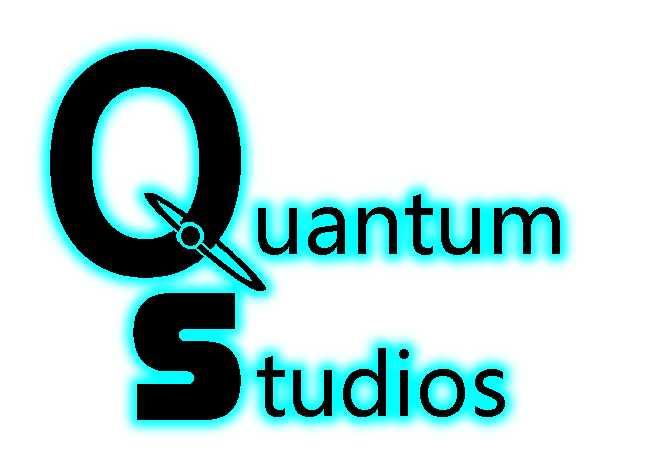

__OBS this repocitory is fully in swedish__
# Projekt Unity 2D Spel - Quantum Coinmaster



## Översikt

Detta projekt är ett skolprojekt som har arbetats på i ca 4-5 veckor, där uppdraget var ett skapa ett 2D spel i unity, med fokus på gränsnitt och änvändarvänlighet.

Vårt spel, Quantum Coinmaster är ett underhållande 2D-plattformsspel utvecklat i Unity, där du som spelare tar rollen som en tidsresande hjälte.Spelet tar sin början när en genial vetenskapsman, under sina experiment för att skapa en portal genom tid och rum, råkar tappa ett antal mystiska mynt i olika tidsepoker. För att återställa balansen i tid och rymd, måste Quantum Coinmaster resa genom fyra unika tider och samla in de förlorade mynten.


## Innehållsförteckning


- [Projekt Unity 2D Spel - Quantum Coinmaster](#projekt-unity-2d-spel---quantum-coinmaster)
  - [Översikt](#översikt)
  - [Innehållsförteckning](#innehållsförteckning)
  - [För att Spela spelet!](#för-att-spela-spelet)
    - [Bidra till projektet](#bidra-till-projektet)
    - [Gör ändringar och commita dem](#gör-ändringar-och-commita-dem)
  - [Spelet](#spelet)
    - [Spelupplevelse](#spelupplevelse)
  - [Designval och Motivering](#designval-och-motivering)
    - [Gränssnitt och Användarvänlighet](#gränssnitt-och-användarvänlighet)
    - [Grafik och Resursfördelning](#grafik-och-resursfördelning)
  - [Tack till](#tack-till)
  - [Verktyg och källor](#verktyg-och-källor)
    - [Verktyg](#verktyg)
    - [Källor](#källor)
  - [Licens](#licens)
  - [Kontakt](#kontakt)

## För att Spela spelet!

Gå in på Teams, Simon om du har blivit inbjuden (Sofie och Per) till en grupp som heter Spel | Quantum Coinmaster.
Gå sedan till > För Lärare > Filer > ladda ner den senaste versionen av Version_Open Alpha.

Om du inte här tillgång till denna länk laddda ner filen från [Google drive](https://drive.google.com/file/d/16vFsVQnBeN-pLbjVgwRQ8COmdG1K-vij/view?usp=sharing)

Det kan vara så att man måste unzipa filen. Sedan startar du spelet genom att öppna Quantum Coinmaster.exe! Enjoy!

### Bidra till projektet

För att kunna bidra tillprojektet måste man komma åt källkoden genom att klona vårat repocitoriet och skapa en egen branch från main om du vill bidra tillprojektet.

```bash
git clone https://github.com/ditt-användarnamn/quantum-coinmaster.git # Klona Repot

cd quantum-coinmaster
git checkout -b din-egen-branch  # Skapa en egen Branch
```

Öpna sedan projektet i en valfri kodrediskerare, samt i unity för att att se grafik och testa spelet.

### Gör ändringar och commita dem

```bash
git add .
git commit -m "Beskrivning av dina ändringar"
git push origin din-egen-branch # Pusha din branch till GitHub
# Öppna en pull request på GitHub för att föreslå ändringarna
```
## Spelet

Din uppgift är att navigera genom fyra distinkta tidsepoker: Edwardian era, Egypten, månen och Cyberpunk. Varje tidsera presenterar sina egna unika utmaningar och fiender som du måste övervinna för att samla in de borttappade mynten. Möt historiska figurer, utforska främmande världar och ställ dig mot futuristiska utmaningar när du reser genom tidens väv.

I början av spelet blir du som spelare presenterad en tutorial för att lära sig hur splet fungerar, nya design element och powerups blir sedan suksesivt tilldelade. Spelet har inge direkta fiender, men världen om kring dig vill konstant ta kol på dig.

### Spelupplevelse
  - __Plattformsspel__
- __Fyra Unika Tider__
- __Powerups:__ Samla kraftfulla powerups som kommer att hjälpa dig övervinna hinder och klara varje nivå snabbare.
-  __Pixelart Grafik:__ Upplev charmen av pixelart-grafik som ger spelet en unik och nostalgisk estetik.
-  __Spara Spelet__ spelet har checpoints i for av paper boys där man kan spara spelet och gå tillbaka till det vid en annan tidpunkt.


## Designval och Motivering

När vi formar ett spel strävar vi efter att göra det så tillgängligt som möjligt för en bred publik. Detta innebär att inte bara skapa ett gränssnitt som är användarvänligt utan också att vara medvetna om resursanvändningen för att säkerställa att spelet kan köras smidigt på alla enheter.

### Gränssnitt och Användarvänlighet

För att maximera användarvänligheten har vi vidtagit flera åtgärder för att göra spelet lätt att förstå:

- **Interaktiv Tutorial:** Spelet inleds med en interaktiv tutorial där spelaren gradvis introduceras till nya mekaniker, såsom gående, hoppande, glidande och till slut kombinationen av hopp och glid.
- **Succesiv Introduktion:** I övriga nivåer introduceras nya spelmekaniker successivt för att undvika överväldigande upplevelser, som exempelvis laserfällorna på månen.
- **Tydligt GUI:** Vi har implementerat ett tydligt GUI med hög kontrast, lättförståeliga knappar och indikatorer som tydligt visar antalet samlade mynt.
- **Powerups:** Det är klart och tydligt när spelaren kan använda power-ups, och under nedkylningstiden blir de gråa för att undvika förvirring.
- **Ljud:** Genom att integrera ljud för hopp, glidande, myntinsamling och användning av power-ups skapas en klarare spelupplevelse.
- **Dödliga Objekt:** Farliga objekt är lätt identifierbara, och när spelaren dör är det tydligt att de måste börja om från början.
- **Hög Kontrast:** Exempelvis på månbanan ger hög kontrast mellan den grå marken, den grå bakgrunden och de gröna fienderna en klar visuell förståelse.

### Grafik och Resursfördelning

Vi har också noggrant övervägt resursfördelningen för att optimera spelets prestanda:

- **Pixelart:** Användningen av pixelart ger spelet en minimalistisk estetik samtidigt som det minimerar resurskravet.
- **Animering:** Huvudkaraktären och vissa NPCs har animerats för att öka visuell tilltalande, men överdriven animering undviks för att bibehålla prestanda.
- **Statisk Bakgrund:** Mestadels statiska bakgrunder har valts för att prioritera förgrunden och minska belastningen på resurserna.
- **Parallax-effekter:** Genom att implementera parallax på bakgrunden skapas en illusion av djup och 3D utan att öka belastningen substansiellt.
- **Scenuppdelning:** Genom att uppdelning i olika scener minskar vi antalet objekt som spelet behöver hantera samtidigt, vilket resulterar i förbättrad prestanda.
- **Objektdestruktion:** På mån- och Cuberpunk-nivåerna försvinner vissa laserstrålar efter en viss tid för att minska antalet objekt i spelet och därigenom optimera resursanvändningen.


## Tack till

Vi vill tacka alla som har bidragit till Quantum Coinmaster-projektet. Deras engagemang och insatser har varit avgörande för projektets framgång.


- ### Simon Meier -  [abbsimmei](https://github.com/abbsimmei)

  - __Projektledare__
  - __Level Design__
    - Egypt Scene
    - Pyramid Scene
    - Moon Scene 1,2
    - Cyberpunk Scene
    - Outro Cutscene
  - sprite design 
  - Tilemaps Design
  - Rörelse av karaktären
  - Camera movement
  - "Death and respawn"
  - Bugfixd


- ### Viggo Haimanas Bygden [abbvighai](https://github.com/abbvighai)
  - __Ansvariga för Grafisk design__
    - Sprites
    - TileMaps
  - __TileMap__
  - level design
    - __Tutorial__
    - Edwardiant scene
    - Intro Cutscene
  - Animering
  - Dialoger
  - BugFix
- ### Sebastian Alin [sebastian200](https://github.com/sebastian200)
  - __Ansvarig för kod och spelmekanik__
  - __GUI design__
    - Menu
    - Main Menu
    - Death Screan
  - Coin Collection
  - PowerUps
  - Save And loading
  - __Sound Designer__
    - Musik
    - AmbientSounds
    - SFX
    - Inspelning av ljud
  - Bugfix
 
## Verktyg och källor

Vi har använt följande verktyg och källor i utvecklingen av Quantum Coinmaster:

### Verktyg

1. [**Unity Game Engine**](https://unity.com/) - Unity har varit kärnan i vårt projekt att skapa vårt spel
2. [**Github**](https://github.com/abbindustrigymnasium/2d-spel-i-unity-grupp-sebastian) - Platform rediskera och dela samma kod på olka datorer
3. [**Pain.NET**](https://www.getpaint.net/) - Design av sprites och Tilemap
4. [**Audacity**](https://www.audacityteam.org/) - Inspelning av ljud

### Källor

1.  [__Chat GPT__](https://chat.openai.com/c/1f4196ea-ee94-4880-be12-9dea5411ec90 ) - Använt flr Prototyper av kod, till hjälp med byggfixing
  2. [__Pixaaby__](https://pixabay.com/sound-effects/search/freesounds/) källa för ljud och SFX
3. [__bing immage creator__](https://www.bing.com/create) Bilder som refernsmatial
4. [__Unity Docs__](https://docs.unity.com/) källa för kod till unty
5. [__stack overflow__](https://stackoverflow.com/) Kod till unity och bugfixes
6. [__Youtube__](https://youtube.com/) Tutorial Videor till projektet (se alla videor Här:)
   - [The Unity Tutorial For Complete Beginners](https://www.youtube.com/watch?v=XtQMytORBmM&t=700s)
   - [Grunderna till c# spellista](https://www.youtube.com/watch?v=N775KsWQVkw&list=PLPV2KyIb3jR4CtEelGPsmPzlvP7ISPYzR)
   - [Grunderna av unity Spellista](https://www.youtube.com/watch?v=on9nwbZngyw&list=PLPV2KyIb3jR6TFcFuzI2bB7TMNIIBpKMQ)
     - Player Movement, video 2
     - Camera Movement, video 4
     - 2D Animation, video 3
   - [Grunderna av unity Spellista (av en annan skapare)](https://www.youtube.com/watch?v=Ii-scMenaOQ&list=PLrnPJCHvNZuCVTz6lvhR81nnaf1a-b67U)
     - Tilemap & Tile Palette, video 2
     - Animation, video 4
     - Grounding Check Using Boxcast, video 6
     - Player Death Logic, video 8
     - Moving platforms, video 9
   - [2D COIN COLLECTING IN UNITY! ](https://www.youtube.com/watch?v=YUp-kl06RUM)
   - [How to make a Dialogue System in Unity](https://www.youtube.com/watch?v=_nRzoTzeyxU)
   - [SAVE & LOAD SYSTEM in Unity](https://www.youtube.com/watch?v=XOjd_qU2Ido&t=2s)
   - [Unity UI Tutorial](https://www.youtube.com/watch?v=IuuKUaZQiSU)
   - [START MENU in Unity](https://www.youtube.com/watch?v=zc8ac_qUXQY)
   - [SETTINGS MENU in Unity](https://www.youtube.com/watch?v=YOaYQrN1oYQ)
   - [Introduction to AUDIO in Unity](https://www.youtube.com/watch?v=6OT43pvUyfY)
   - [Easy Tilemaps and Dynamic Auto Tiling - Unity 2D](https://www.youtube.com/watch?v=8UctaO5DwUE)
   - [2D Platformer Movement With Unity's New Input System](https://www.youtube.com/watch?v=24-BkpFSZuI)
   - [How to make a 2D Slide](https://www.youtube.com/watch?v=vqdSfMxbdPc)
   - [Idle, Run and Jump Animations](https://www.youtube.com/watch?v=Sg_w8hIbp4Y)

## Licens
Denna projekt och dess kod släpps under en öppen källkodslicens, vilket ger alla friheten att använda, ändra och dela innehållet och koden fritt.

## Kontakt
kontakta oss visa Teams eller på Mail

[Sebastian Alin](sebastianalin@hitachigymnasiet.se)